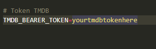
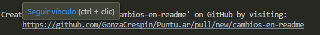

# ⭐Puntu.ar: Configuración de entorno local

## Requisitos Previos
Antes de comenzar tener instalado lo siguiente:
- Docker: [Instalar Docker](https://desktop.docker.com/win/main/amd64/Docker%20Desktop%20Installer.exe?utm_source=docker&utm_medium=webreferral&utm_campaign=dd-smartbutton&utm_location=module)
- Git: [Instalar Git](https://github.com/git-for-windows/git/releases/download/v2.49.0.windows.1/Git-2.49.0-64-bit.exe)
- Node: [Instalar Node](https://nodejs.org/dist/v22.14.0/node-v22.14.0-x64.msi)
- Angular: 
```bash
npm install -g @angular/cli
```

## Configuración del Proyecto

### Paso 1: Clonar repositorio
1. Clonar:
```bash
git clone https://github.com/GonzaCrespin/Puntu.ar
cd Puntu.ar
```
### Paso 2: Configurar entorno
2. Copiar .env:
```bash
cp .env.example .env
```
*Para obtener una credeencial de API de TMDB, [registrarse](https://www.themoviedb.org/signup?language=es)*


3. Configurar .env con tus credenciales.
### Paso 3: Configurar frontend
4.  Instalar las dependencias del frontend:
```bash
cd frontend
npm install
```
5. Como levantar el frontend:
```bash
ng serve
```
### Paso 4: Construir docker de la DB
6. Buildear y levantar el docker
```bash
cd ../docker
docker-compose up -d
```
### Paso 5: Configurar backend.
7. Instalar las dependencias del frontend:
```bash
cd ../backend
npm install
```
8. Como levantar el backend:
```bash
npm run dev
```

## Probar el entorno completo
1. Levantar todo completo:
```bash
start.bat
```
**Si es necesario modificar el archivo para levantar lo que desee.**

## Como hacer cambios?
1. Asegurate de tener la version más actualizada:
Cambia a la rama principal:
```bash
git checkout main
```

Obtiene los cambios mas recientes:
```bash
git pull origin main
```

2. Crear una rama para nuevos cambios:
```bash
git checkout -b nombre-de-la-rama
```

3. Hacer tus cambios y probarlos localmente.
4. Subirlos:
```bash
git add .
git commit -m "Descripción clara del cambio"
git push origin nombre-de-tu-rama
```
5. Pulsar aqui para crear un pull request con alguna descripcion adicional del cambio **(Opcional)**
